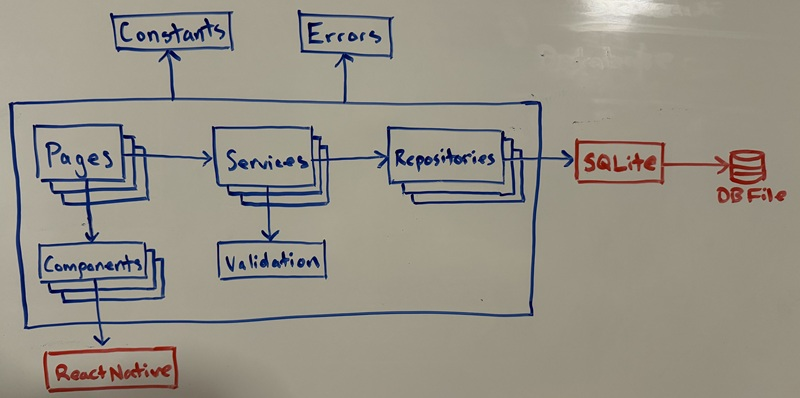
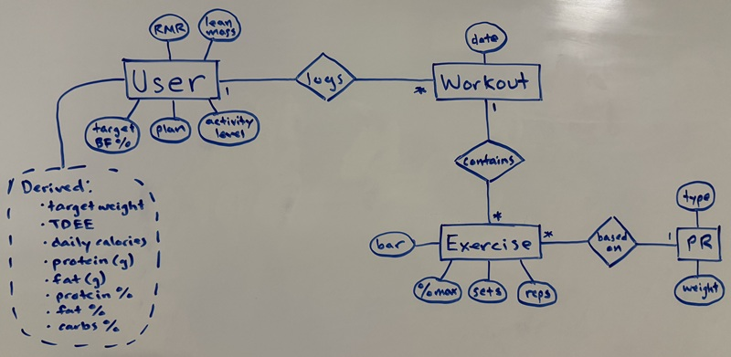

# fitness-tracker-48

A 48-hour project to build a simple fitness tracker app. Calculates calories and macros. Tracks and calculates workouts.

## Scrum

### Product Backlog

| To Do | Doing | Done |
|---|---|---|
| Workouts | Macros and Calories | Setup |
| Testing |  | Requirements Specification |
| Deployment |  | Architecture Specification |

### Sprint 2: Macros and Calories

#### Velocity: 

#### Backlog

| Feature | Points |
|---|---|
| Formula Logic | 3 |
| AsyncStorage Logic | 5 |
| Components | 3 |
| Pages | 2 |
| Navigation Logic | 3 |
| State and Hooks | 5 |
| Testing | 5 |

| To Do | Doing | Done |
|---|---|---|
| Navigation Logic | Components | Formula Logic |
| State and Hooks | Pages | AsyncStorage Logic |
| Testing |  |  |

### Sprint 1: Setup, Requirements Specification, and Architecture Specification

#### Velocity: 25

#### Backlog

| Feature | Points |
|---|---|
| Set up GitHub | 2 |
| Set up Scrum | 3 |
| Set up Expo Project | 2 |
| User Stories | 5 |
| Component Diagram | 5 |
| ER Diagram | 5 |
| Database Schema | 3 |

| To Do | Doing | Done |
|---|---|---|
|  |  | Set up GitHub |
|  |  | Set up Scrum |
|  |  | Set up Expo Project |
|  |  | User Stories |
|  |  | Component Diagram |
|  |  | ER Diagram |
|  |  | Database Schema |

## Requirements Specification

### User Stories

| As a ... | I want to ... | so that I can ... |
|---|---|---|
| user | enter physiological data and goals | generate macro and calorie recommendations. |
| user | view macro and calorie recommendations | review the information. |
| user | view PRs | select a PR. |
| user | add a PR | input new information. |
| user | view a PR | review the information. |
| user | edit a PR | modify the information. |
| user | view workouts | select a workout. |
| user | add a workout | input new information. |
| user | view a workout | review the information. |
| user | edit a workout | modify the information. |

## Architecture Specification

### Component Diagram

### ER Diagram

### App Data and Database Schema

## Tools and Technologies

- JavaScript
- React Native
- AsyncStorage
- SQLite
- Expo
