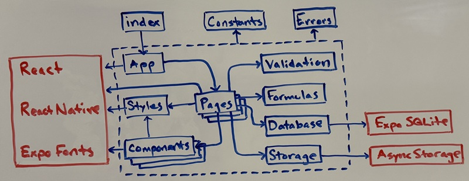
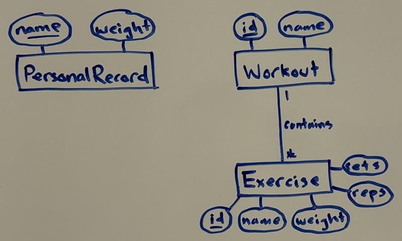
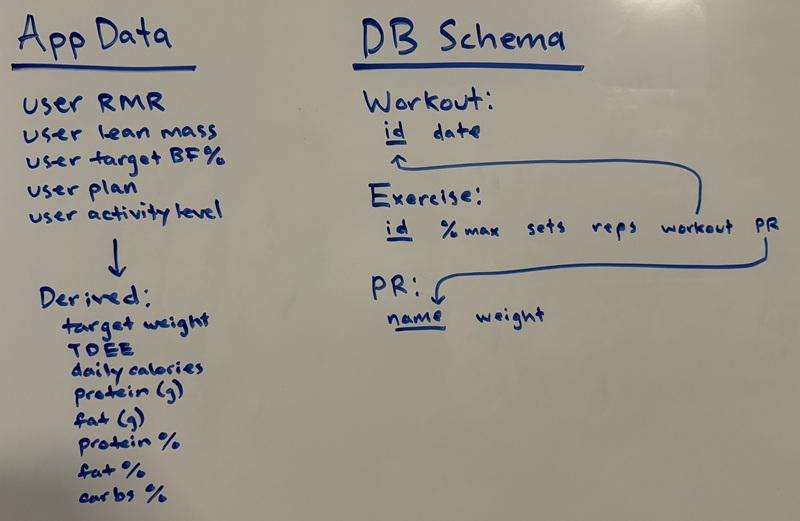

# fitness-tracker-48

A 48-hour project to build a simple fitness tracker app. Calculates calories and macros. Tracks and calculates workouts.

## Scrum

### Product Backlog

| To Do | Doing | Done |
|---|---|---|
| Deployment | Polish | Setup |
| Documentation |  | Requirements Specification |
|  |  | Architecture Specification |
|  |  | Macros and Calories |
|  |  | PRs |
|  |  | Workouts |
|  |  | Exercises |

### Sprint 6: Polish

#### Velocity: 

#### Backlog

| Feature | Points |
|---|---|
| Trim Input/Output Scope | 5 |
| Clarify Naming | 3 |
| Add Headings | 3 |
| Add 3 Colors | 3 |
| Fit ScrollViews | 3 |
| Standardize Element Sizes | 5 |

| To Do | Doing | Done |
|---|---|---|
| Add 3 Colors | Trim Input/Output Scope |  |
| Fit ScrollViews | Clarify Naming |  |
| Standardize Element Sizes | Add Headings |  |

### Sprint 5: Exercises

#### Velocity: 18

#### Backlog

| Feature | Points |
|---|---|
| Database Setup | 2 |
| Expo SQLite Logic | 2 |
| Pages | 2 |
| Components | 2 |
| State and Hooks | 5 |
| Testing | 5 |

| To Do | Doing | Done |
|---|---|---|
|  |  | Database Setup |
|  |  | Expo SQLite Logic |
|  |  | Pages |
|  |  | Components |
|  |  | State and Hooks |
|  |  | Testing |

### Sprint 4: Workouts

#### Velocity: 20

#### Backlog

| Feature | Points |
|---|---|
| Database Setup | 2 |
| Expo SQLite Logic | 3 |
| Pages | 3 |
| Components | 2 |
| State and Hooks | 5 |
| Testing | 5 |

| To Do | Doing | Done |
|---|---|---|
|  |  | Database Setup |
|  |  | Expo SQLite Logic |
|  |  | Pages |
|  |  | Components |
|  |  | State and Hooks |
|  |  | Testing |

### Sprint 3: PRs

#### Velocity: 21

#### Backlog

| Feature | Points |
|---|---|
| Database Setup | 3 |
| Expo SQLite Logic | 3 |
| Pages | 3 |
| Components | 2 |
| State and Hooks | 5 |
| Testing | 5 |

| To Do | Doing | Done |
|---|---|---|
|  |  | Pages |
|  |  | Components |
|  |  | Database Setup |
|  |  | Expo SQLite Logic |
|  |  | State and Hooks |
|  |  | Testing |

### Sprint 2: Macros and Calories

#### Velocity: 26

#### Backlog

| Feature | Points |
|---|---|
| Formula Logic | 3 |
| Async Storage Logic | 5 |
| Pages | 2 |
| Components | 3 |
| Navigation Logic | 3 |
| State and Hooks | 5 |
| Testing | 5 |

| To Do | Doing | Done |
|---|---|---|
|  |  | Formula Logic |
|  |  | Async Storage Logic |
|  |  | Pages |
|  |  | Components |
|  |  | Navigation Logic |
|  |  | State and Hooks |
|  |  | Testing |

### Sprint 1: Setup, Requirements Specification, and Architecture Specification

#### Velocity: 25

#### Backlog

| Feature | Points |
|---|---|
| Set up GitHub | 2 |
| Set up Scrum | 3 |
| Set up Expo Project | 2 |
| User Stories | 5 |
| Component Diagram | 5 |
| ER Diagram | 5 |
| Database Schema | 3 |

| To Do | Doing | Done |
|---|---|---|
|  |  | Set up GitHub |
|  |  | Set up Scrum |
|  |  | Set up Expo Project |
|  |  | User Stories |
|  |  | Component Diagram |
|  |  | ER Diagram |
|  |  | Database Schema |

## Requirements Specification

### User Stories

| As a ... | I want to ... | so that I can ... |
|---|---|---|
| user | enter physiological data and goals | generate macro and calorie recommendations. |
| user | view macro and calorie recommendations | review the information. |
| user | view PRs | review the information. |
| user | add a PR | input new information. |
| user | edit a PR | modify the information. |
| user | delete a PR | remove the information. |
| user | view workouts | select a workout. |
| user | add a workout | input new information. |
| user | delete a workout | remove the information. |
| user | view a workout | review the information or add exercises. |
| user | add an exercise | input new information. |
| user | delete an exercise | remove the information. |

## Architecture Specification

### Component Diagram

### ER Diagram

### App Data and Database Schema

## Tools and Technologies

- JavaScript
- React Native
- Async Storage
- Expo SQLite
- Expo
